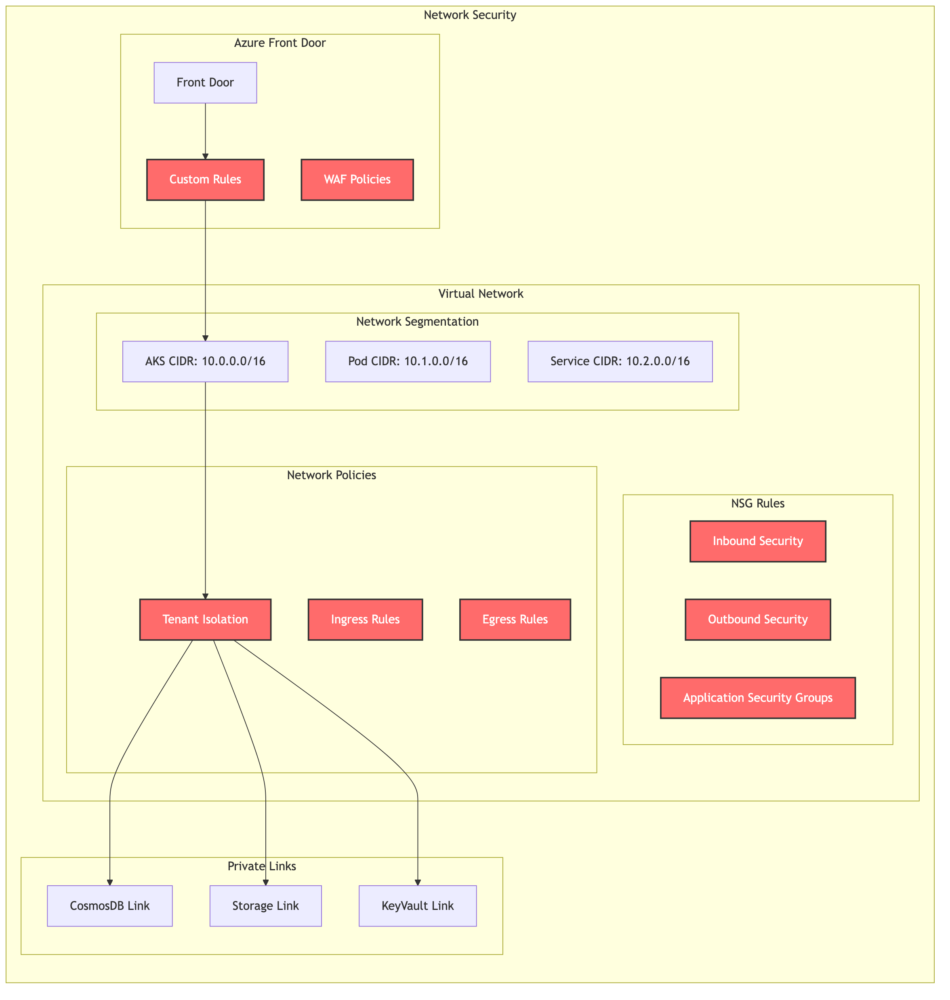

# Ping Me - Enterprise Collaboration Platform

## Overview

Ping Me is a revolutionary collaboration platform designed to transcend organizational boundaries, enabling meaningful conversations, generating valuable insights, and driving productive actions. By enhancing and combining the capabilities of various standalone business tools, Ping Me offers a unified platform that empowers users to unlock the full potential of their discussions.

## Key Features

### Pre-Meeting Capabilities
- **Organization-Independent Accounts**: Create accounts independently of any corporate entity
- **NFT-Based Digital Business Cards**: Facilitate efficient collaboration through digital invitations
- **Intelligent Profile Generation**: 
  - Self-input or LinkedIn integration
  - Salesforce data import
  - Automated validation and processing
  - **Advanced Profile Enrichment**: Continuous learning from user interactions

### Live Meeting Features
- **Real-Time Recording & Transcription**: Automatic conversation capture and processing
- **AI-Powered Analysis**: 
  - Live insights and discussion prompts
  - Real-time data analysis
  - Contextual suggestions
- **Dynamic Participant Management**: Add participants seamlessly during active sessions
- **Secure Data Sharing**: Upload and analyze data within the chat environment

### Post-Meeting Tools
- **Smart Summary Generation**: 
  - Key point extraction
  - Action item categorization
  - Profile-based insights
- **Integration Ecosystem**: 
  - Jira and Monday.com connectivity
  - Automated action tracking
  - Cross-platform synchronization
- **Historical Access**: Review and update previous conversations
- **Analytics Engine**: Generate comprehensive analytical reports

## Security & Compliance

### Data Protection
- Multi-level tenant isolation
- End-to-end encryption
- Granular access controls
- Geographic data compliance

### Network Security
- Azure Front Door integration
- WAF protection
- Network segmentation
- Private endpoint connections

## Technical Architecture

### Infrastructure Overview
- Microservices-based architecture
- Kubernetes orchestration
- Multi-region deployment
- Automated scaling

### Authentication & Authorization
- Federation support
- RBAC implementation
- JWT-based session management
- Multi-tenant isolation

### Data Processing Pipeline
- Real-time audio processing
- LLM-powered analysis
- Data anonymization
- Multi-tier storage
- **Adaptive Learning**: Personalized model training based on user interactions

## Getting Started

### User Onboarding
1. Create account via email or LinkedIn
2. Complete profile setup
3. Generate digital business card
4. Start collaborating

### Starting a Meeting
1. Initialize new session
2. Invite participants
3. Enable required features
4. Begin recording

### Managing Insights
1. Review AI-generated summaries
2. Track action items
3. Generate reports
4. Share findings

## Cost Analysis

For organizations considering deployment options, we provide detailed cost analysis for both API-based and self-hosted LLM solutions in our [cost comparison document](llm_cost_comparison.md).

## Deployment Options

### Cloud Deployment
- Azure-native implementation
- Multi-region support
- Automatic scaling
- Managed services integration

### On-Premises
- Kubernetes-based deployment
- Private cloud support
- Hardware optimization
- Local LLM hosting

## Support & Documentation

For detailed technical documentation, API references, and deployment guides, please visit our [documentation portal](https://docs.pingme.com).

For support inquiries:
- Technical Support: support@pingme.com
- Sales Inquiries: sales@pingme.com
- General Questions: info@pingme.com

## License

Copyright © 2024 Ping Me Technologies Ltd.
All rights reserved.
